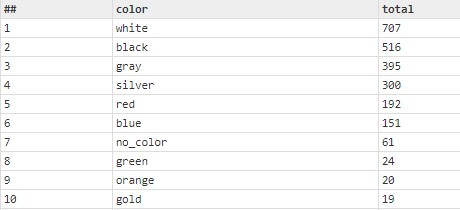

# In Class Practice

For today's session, we are going to cover Table function and created two tables using Cars dataset

**Practice #1**

1- How many cars per brand are in each year?\
2- Write two test cases that shows your solution is correct

Sample Result\

**Practice #2**

In our week 4 practice, we used a SET to randomly define a few dark colors, now we are going to capture all colors and the count for each color.

1- Use Table to capture all colors and total count for each color.\
2- add a few more colors to your already defined set.\
3- Data Validation: Now that you have all colors, take a quick look and see if they are all valid.

Sample Result\

