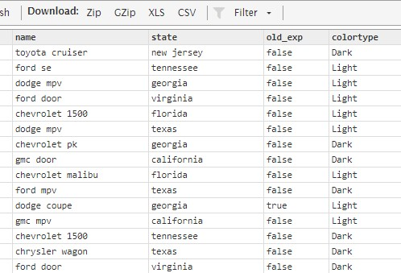

# In Class Practice

For today's session, we are going to create a new dataset from Cars dataset with following features:

New dataset will have 4 fields:

- name: model + brand
- State: state
- Old_Exp: is over 10000, and made before 2012
- colorType: Dark if it's in darker shades and rest count as light colors

Hint :

- Use of getCars module
- Set
- Transform
- Project

Sample Result

